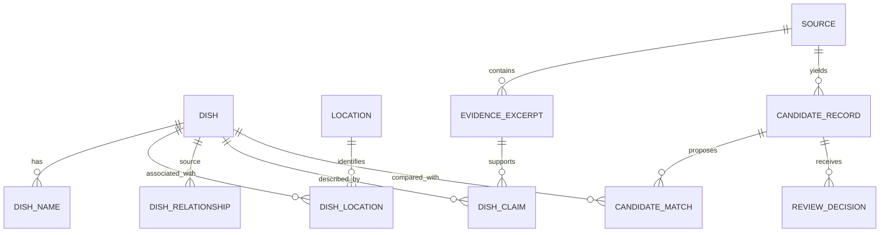

# Database Design — Foundation MVP

**Status:** Initial implementation contract  
**Date:** 20 August 2026

## 1. Design principles

1. Published dishes and unreviewed candidates are separate entities.
2. Evidence attaches to individual claims.
3. Dish identity is separate from names, locations, and source claims.
4. Multiple locations and alternative names are first-class records.
5. AI runs and human decisions remain auditable.
6. Unknown, shared, and contested information must be representable.
7. The foundation must accept later recipe, ingredient, and nutrition modules without redesigning dish identity.

## 2. Entity relationship overview



## 3. Main entities

### Dish

The stable identity of a published or internally approved dish.

Key fields:

- UUID primary key
- Canonical display name
- Slug
- Optional Wikidata QID, retained as a structured reference after review
- Neutral reviewed description
- Category
- Publication status
- Created and updated timestamps

The canonical display name is not assumed to be the historically original name. It is the preferred label for the current interface.
The Wikidata QID is an identity link, not automatic proof of cultural origin,
name equivalence, or publication eligibility.

### DishName

Stores canonical, alternative, local-language, historical, or abbreviated names.

Key fields:

- Dish
- Display name
- Normalised search name
- Language code when known
- Writing system when needed
- Name type
- Preferred flag
- Review status

Only one preferred canonical name should exist for a dish within a language and interface context.

### Location

Represents a country, region, locality, or community through a hierarchical structure.

Key fields:

- UUID
- Name
- Location type
- Parent location
- ISO code when applicable
- Wikidata ID when available

Communities are modelled carefully because cultural identity is not always equivalent to administrative geography.

### DishLocation

Represents a reviewed relationship between a dish and a location.

Relationship types:

- Associated with
- Documented in
- Commonly consumed in
- Claimed origin
- Shared across
- Uncertain

It does not reduce a dish to one mandatory country of origin.

### DishRelationship

Connects two dish records.

Relationship types:

- Variant of
- Related to
- Served with
- Derived from
- Uncertain relationship

“Same as” is handled through review and merge logic, not as a permanent public relationship between duplicate records.

### Source

Stores source-level metadata and licensing information. Source records are immutable with respect to the historical retrieval event; a materially changed web page should produce a new retrieval record or snapshot reference.

### EvidenceExcerpt

Stores the minimal section of a source needed to evaluate a claim, plus a locator and optional source-provided language.

### DishClaim

Stores one reviewable factual proposition.

Examples:

- A description statement
- A location association
- A name equivalence
- An ingredient mention
- A dish relationship

The MVP stores flexible claim values as JSON while the team observes real source patterns. Frequently reviewed claim types can later become stricter domain tables.

### CandidateRecord

Stores information before it becomes an approved dish or approved claim.

Key fields:

- Source
- Submitted source text
- Extraction model
- Prompt version
- Raw model response
- Schema-validated payload
- Processing state
- Validation errors
- Created timestamp

### CandidateMatch

Stores a proposed comparison between a candidate and an existing dish.

Suggested outcomes:

- New dish
- Same dish
- Regional variant
- Related dish
- Uncertain

It stores deterministic signals separately from the model recommendation and rationale.

### ReviewDecision

Records the human action taken on a candidate.

Actions:

- Approve as new dish
- Link to existing dish
- Approve as variant
- Approve as related
- Edit and approve
- Reject
- Needs more evidence

The final affected dish, reviewer, notes, and timestamp are retained.

## 4. Candidate extraction contract

The structured extraction payload should initially follow this shape:

```json
{
  "candidate_name": "string",
  "description": {
    "value": "string or null",
    "evidence": "exact minimal excerpt or null"
  },
  "alternative_names": [
    {
      "name": "string",
      "language_code": "string or null",
      "evidence": "exact minimal excerpt"
    }
  ],
  "location_claims": [
    {
      "location_name": "string",
      "relationship": "associated_with | documented_in | commonly_consumed_in | claimed_origin | shared_across | uncertain",
      "evidence": "exact minimal excerpt"
    }
  ],
  "category": {
    "value": "string or null",
    "evidence": "exact minimal excerpt or null"
  },
  "ingredient_mentions": [
    {
      "name": "string",
      "evidence": "exact minimal excerpt"
    }
  ],
  "ambiguities": ["string"],
  "unsupported_or_missing_fields": ["string"]
}
```

The schema deliberately contains evidence alongside proposed values. A valid JSON response without evidence is not publication-ready.

## 5. Constraints and indexes

- Unique normalised name per dish, language, and name type where appropriate
- Unique Wikidata ID when present
- Unique source URL plus retrieval date for web retrievals
- Full-text or trigram search index for names in PostgreSQL
- Index on candidate processing status
- Index on claim review status and claim type
- Index on source tier and source type
- Check constraints for confidence scores between 0 and 1
- Prevent self-referential dish relationships
- Prevent the same relationship pair from being entered repeatedly

## 6. Publishing rule

A `Dish` can be public only when:

- Its publication status is `published`.
- It has at least one reviewed display name.
- Its public description and relationships are generated from eligible claims.
- No required review action is pending.

The public page must query reviewed domain records and eligible claims, never raw `CandidateRecord` payloads.

## 7. Future extension points

The next domain modules can attach to `Dish` without altering its identity:

- RecipeVariation
- Ingredient
- RecipeIngredient
- FoodCompositionSource
- IngredientNutrientValue
- PortionMeasure
- CookingYield
- NutrientRetentionFactor
- CalculatedDishNutrition
- LaboratoryAnalysis

These tables are intentionally excluded from the foundation migration.
